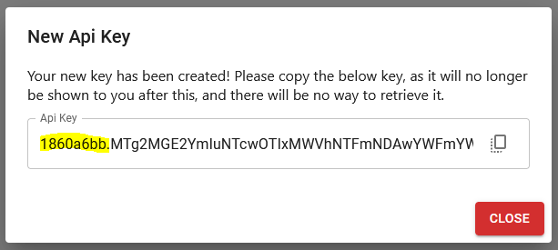
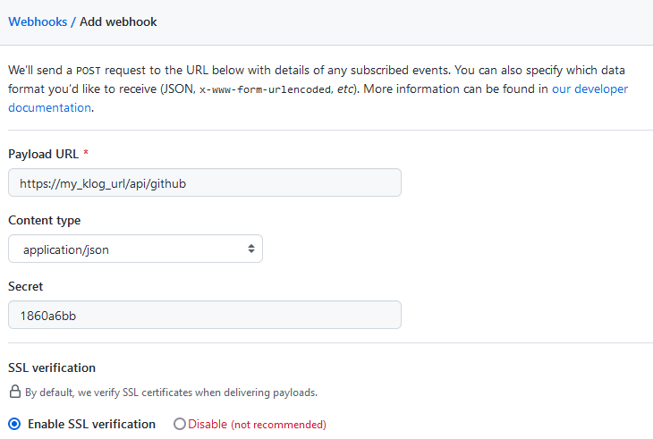

# GitHub

KLog has an endpoint that is setup to receive events from GitHub's webhooks, and
utilizing it is fairly simple.

1. Log in to KLog and create a new API Key named "GitHub"

2. Make note of the ID (the first part of the api key) that you get when
   hitting save. This will be used as the secret key within the GitHub webhook.

3. From GitHub, create a new webhook with the following settings:

- Payload URL: KLOG_URL/api/github
- Content type: application/json
- Secret: The ID from step 2
- SSL verification: Enable SSL verification

4. Now, whenever the new webhook triggers, you should see the logs displayed
   within the KLog Feed!
